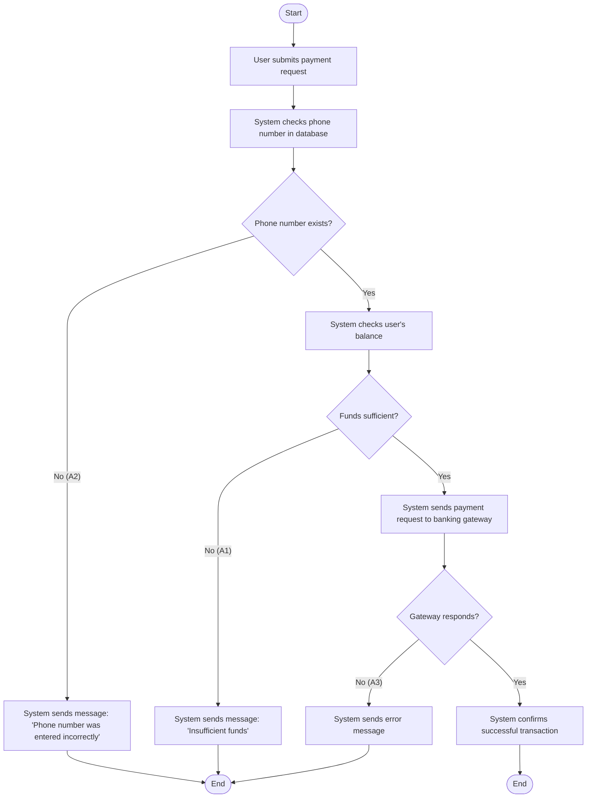

```mermaid
flowchart TD
    Start([Start]) --> Step1[User submits payment request]
    
    %% Step 1: Check Phone Number (A2)
    Step1 --> CheckPhone[System checks phone number in database]
    CheckPhone --> PhoneExists{Phone number exists?}
    
    PhoneExists -- No (A2) --> MsgPhone[System sends message: 'Phone number was entered incorrectly']
    MsgPhone --> EndFail([End])

    %% Step 2: Check Balance (A1)
    PhoneExists -- Yes --> CheckBal[System checks user's balance]
    CheckBal --> BalSufficient{Funds sufficient?}
    
    BalSufficient -- No (A1) --> MsgBal[System sends message: 'Insufficient funds']
    MsgBal --> EndFail

    %% Step 3: Check Gateway (A3)
    BalSufficient -- Yes --> SendGateway[System sends payment request to banking gateway]
    SendGateway --> GatewayResponded{Gateway responds?}
    
    GatewayResponded -- No (A3) --> MsgGateway[System sends error message]
    MsgGateway --> EndFail

    %% Success path
    GatewayResponded -- Yes --> SuccessMsg[System confirms successful transaction]
    SuccessMsg --> EndSuccess([End])
```
